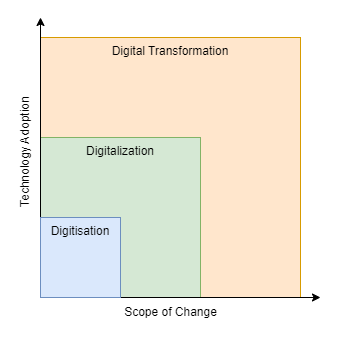
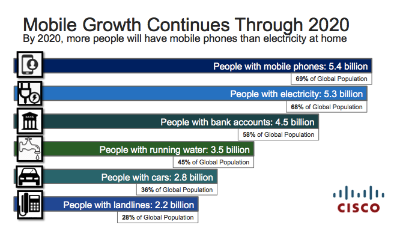
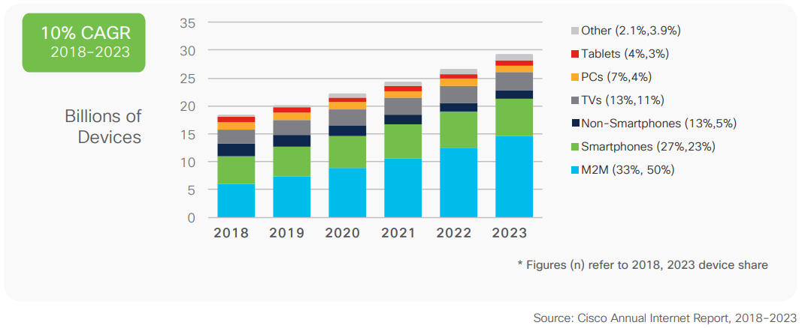
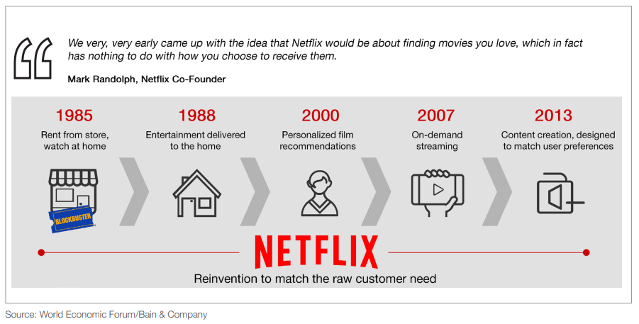
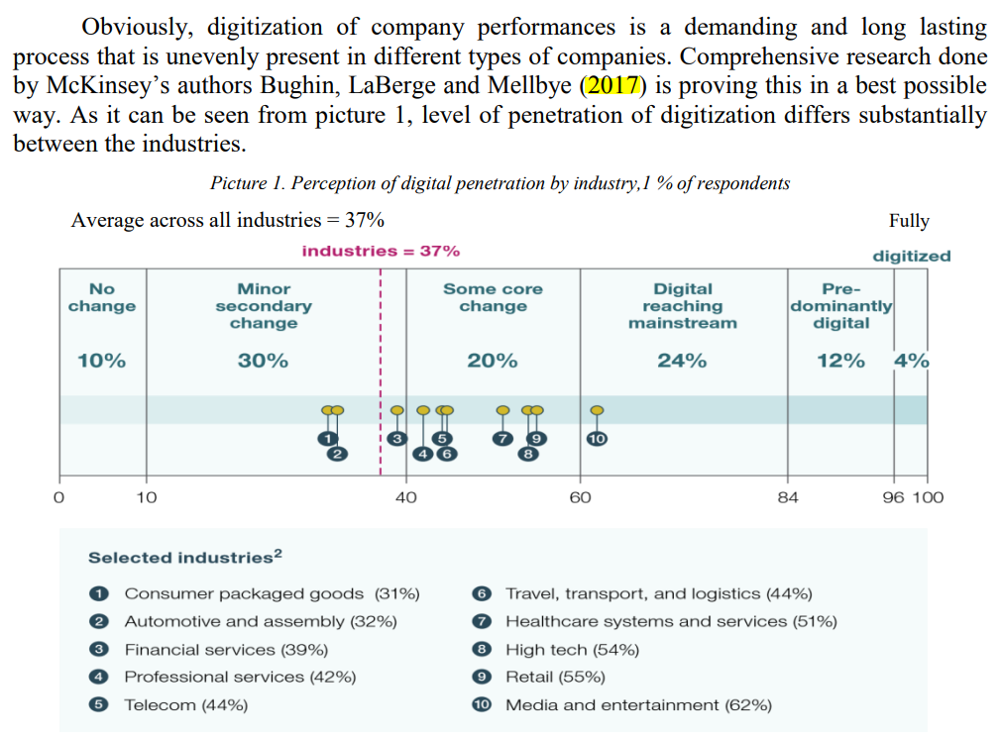
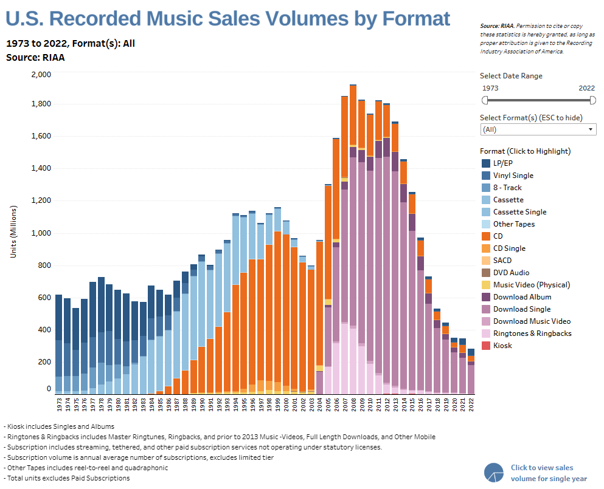
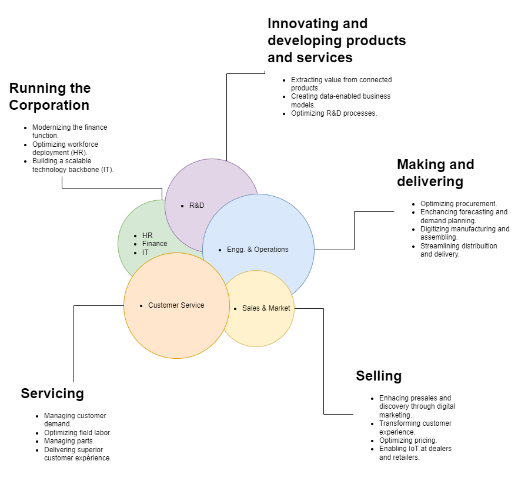
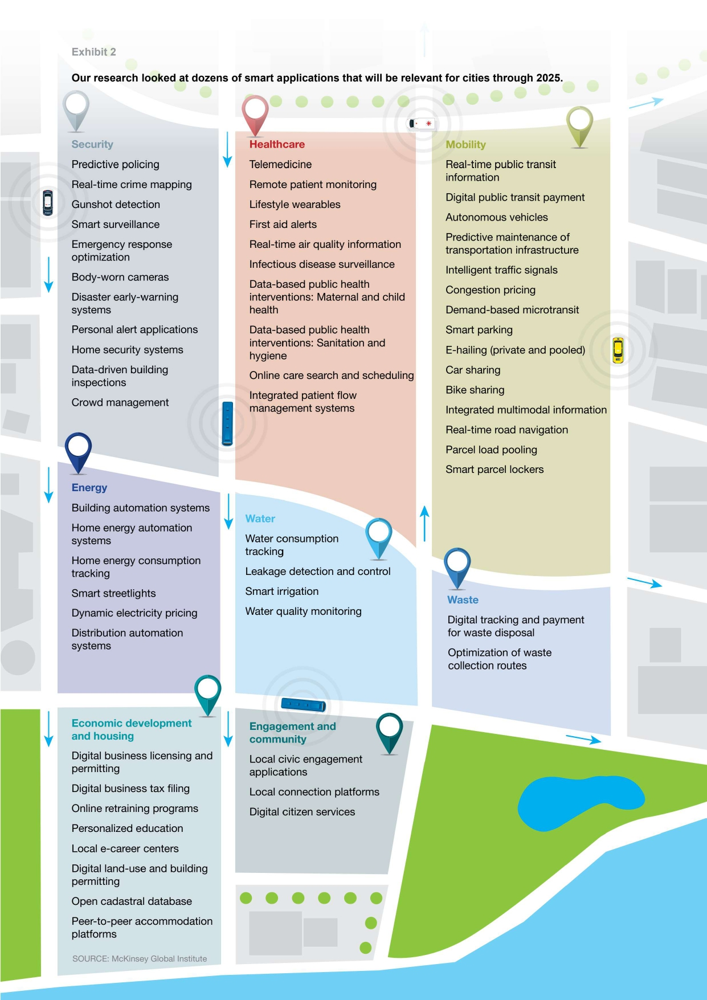
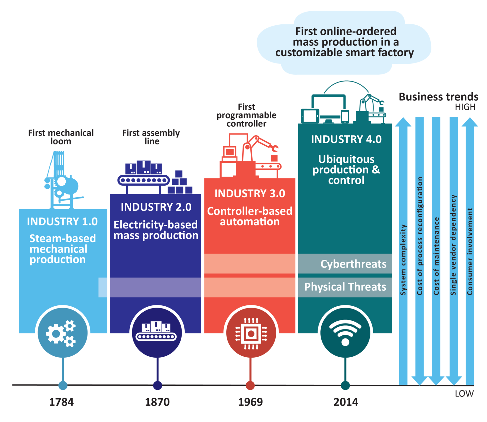

# Industry 4.0 <!-- omit in toc -->

## Contents <!-- omit in toc -->

- [1. What is Digital Transformation \& Industry 4.0](#1-what-is-digital-transformation--industry-40)
  - [1.1. Digitisation](#11-digitisation)
  - [1.2. Digitalization](#12-digitalization)
    - [1.2.1. Consumer perspective](#121-consumer-perspective)
    - [1.2.2. Business perspective](#122-business-perspective)
    - [1.2.3. Enterprise perspective](#123-enterprise-perspective)
  - [1.3. Digital Transformation](#13-digital-transformation)
  - [1.4. Governments are also adopting technology to create Smart Cities \& Society 5.0](#14-governments-are-also-adopting-technology-to-create-smart-cities--society-50)
  - [1.5. Industrial Revolution](#15-industrial-revolution)
    - [1.5.1. First Industrial Revolution](#151-first-industrial-revolution)
    - [1.5.2. Second Industrial Revolution](#152-second-industrial-revolution)
    - [1.5.3. Third Industrial Revolution](#153-third-industrial-revolution)
    - [1.5.4. Fourth Industrial Revolution](#154-fourth-industrial-revolution)
- [2. What are the underlying technologies and use cases](#2-what-are-the-underlying-technologies-and-use-cases)
  - [2.1. Technologies](#21-technologies)
    - [2.1.1. Artificial Intelligence and Machine Learning](#211-artificial-intelligence-and-machine-learning)
    - [2.1.2. Big Data \& Analytics](#212-big-data--analytics)
    - [2.1.3. IoT](#213-iot)
    - [2.1.4. Augmented and Virtual Reality](#214-augmented-and-virtual-reality)
    - [2.1.5. Robotic Process Automation](#215-robotic-process-automation)
    - [2.1.6. Cloud](#216-cloud)
    - [2.1.7. Blockchain](#217-blockchain)
    - [2.1.8. Additive Manufacturing (or 3D Printing)](#218-additive-manufacturing-or-3d-printing)
- [3. Why is Digital Transformation is relevant](#3-why-is-digital-transformation-is-relevant)
- [4. How implement a successful Digital Transformation program](#4-how-implement-a-successful-digital-transformation-program)

# 1. What is Digital Transformation & Industry 4.0

## 1.1. Digitisation

- Digitisation is converting analog information into digital so that computers can store, process, and transmit it.

## 1.2. Digitalization

- Refers to the trend of adoption of digital technology by individuals and companies for perceived benefits.
- It can help provide new revenue generating or cost reduction opportunities for companies and influence social interactions or provide convenience for individuals and society.

### 1.2.1. Consumer perspective

[Cisco Annual Internet Report 2023](/SearchSource/CiscoAnnualInternetReport2023.pdf)

- CAGR = Compound Annual Growth Rate.

### 1.2.2. Business perspective

[Font](SearchSource/DigitalEnterpriseWEF.pdf)

### 1.2.3. Enterprise perspective

[Font](SearchSource/GlobalBrandsInTheDigitalEra.pdf)

[U.S. MUSIC REVENUE DATABAS](https://www.riaa.com/u-s-sales-database/)

## 1.3. Digital Transformation

- Digital Transformation is the sustainable value creation across the whole ecosystem of an organization including employees, customers and partners by adopting digital technologies at scale and driving permanent change in the organization culture.

## 1.4. Governments are also adopting technology to create Smart Cities & Society 5.0

[Font](SearchSource/SmartCitiesMcKinsey.pdf)

## 1.5. Industrial Revolution

### 1.5.1. First Industrial Revolution

- At the end of 18th century, there was the invention of water and steam engine, and this was used for **mechanical production** before that.
- All the industrial work used to be mostly manual and hand driven, and this was called as the first industrial revolution of mechanization with the invention of mechanical loom.

### 1.5.2. Second Industrial Revolution

- Then came electricity and the concept of mass production.
- So this was referred to as the **Second Industrial Revolution** around 1870.

### 1.5.3. Third Industrial Revolution

- And then there was the advancement of electronics computers and also translated into manufacturing and production facilities, which was called automation, or the **Third Industrial Revolution**.
- So controllers or the programmable logic controllers were commonly used at that time to automate the way plants and industrial machinery work.

### 1.5.4. Fourth Industrial Revolution

- Now the fourth Industrial Revolution talks about how digital and physical systems interact with each other.
- It refers to the current and developing environment in which digital technologies are changing the way we live and work.
- More commonly used in industrial and operational context.

- Fourth, Industrial Revolution has really picked up over the last few years is because of four developments or drivers, as you can see on the right hand side.

1. The advancement of these technologies like artificial intelligence, 3D printing, robotics, which gives us newer ways of working and creating benefits and impact for companies.
2. Ability to add sensors because of the lower cost, which means you can read data from machines, and using that data, you can make the machines talk to each other, or you can act between human and machines because you have a common source of data to measure.
3. Data analysis (Computational processing).
4. Data storage (Cost to store cheaper).

- So because of the advancement of these technologies, because of the decrease in cost of, for example, of sensors for storing the data, the fourth industrial revolution now is really in full flow and set up for a very disruptive change in our times to come.

# 2. What are the underlying technologies and use cases

- **Data is at the core of most of the new disruptive technologies today.**

## 2.1. Technologies

- **Devices**
  - Industrial Internet of Things.
  - Drones.
  - Virtual reality / Augmented reality.
- **Intelligence**
  - Big Data Analytics.
  - Artificial Intelligence & Machine Learning.
  - Robotic, Process, Automation.
- **Machines**
  - Advanced Robots.
  - Additive manufacturing 3D Printing.
- **Secure**
  - Cloud.
  - Cybersecurity.
  - Blockchain.
- **Applications**
  - Web & mobile app.
  - Simulation & digital Twins.
  - Connectivity Solutions (e.g 5G, LPWAN).

### 2.1.1. Artificial Intelligence and Machine Learning

- AI is the simulation of human intelligence processes (e.g., learning, reasoning) by machines, especially computer systems.
- Growth propelled by advanced in computing power & storage and explosion of data.
- Edge Computing brings computation and data storage closer to the location where it is needed, to improve response times and save bandwidth.

### 2.1.2. Big Data & Analytics

- Data is **everything**.

### 2.1.3. IoT

- IoT offers the ability for physical objects or humans to generate and communicate meaningful data (e.g., about their condition, position) for analysis and subsequent action.

### 2.1.4. Augmented and Virtual Reality

- AR is an interactive experience of a real-world environment where the objects that reside in the real world are enhanced by computer-generated perceptual information.

### 2.1.5. Robotic Process Automation

- Software based automation tool that automates routine tasks.
- Robot has a user ID just like an employee and can perform rules-based tasks such as accessing email and systems, performing calculations, creating documents and reports, and checking files.

### 2.1.6. Cloud

- Accessing computing resources —including servers, storage, databases, networking, software, analytics, and intelligence—over the Internet and offering real time interaction.
- Can be private, public or hybrid.

[Aws Overview](https://github.com/jeftegoes/AwsOverview)

### 2.1.7. Blockchain

- Blockchain is a digital and distributed ledger of transactions, recorded and replicated in real time across a network of computers or nodes.
- Every transaction must be cryptographically validated via a consensus mechanism executed by the nodes before being permanently added as a new "block" at the end of the "chain".

### 2.1.8. Additive Manufacturing (or 3D Printing)

- Layer by layer deposition of material to make desired object with often complex and intricate design on demand.

# 3. Why is Digital Transformation is relevant

# 4. How implement a successful Digital Transformation program
